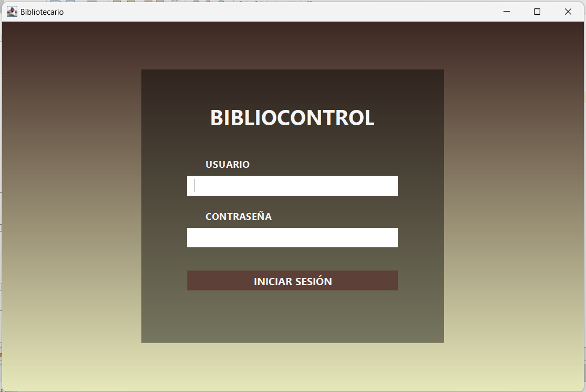
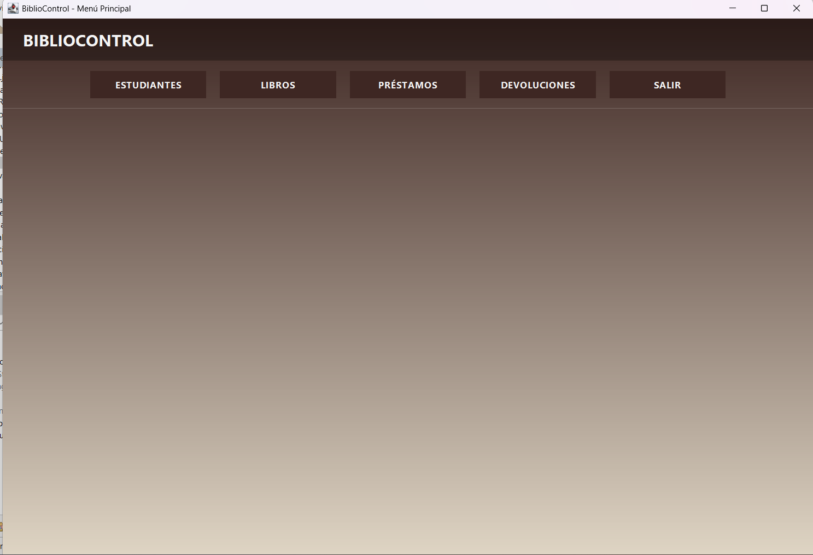
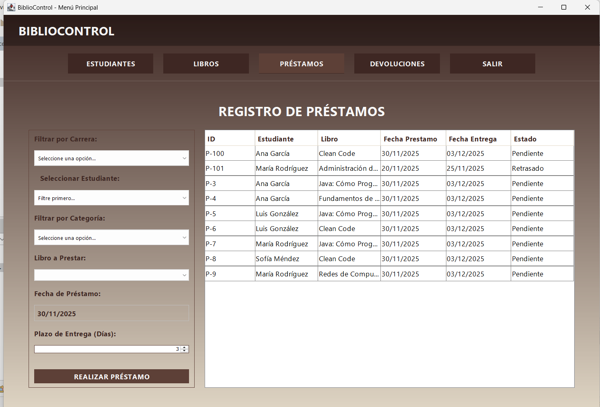
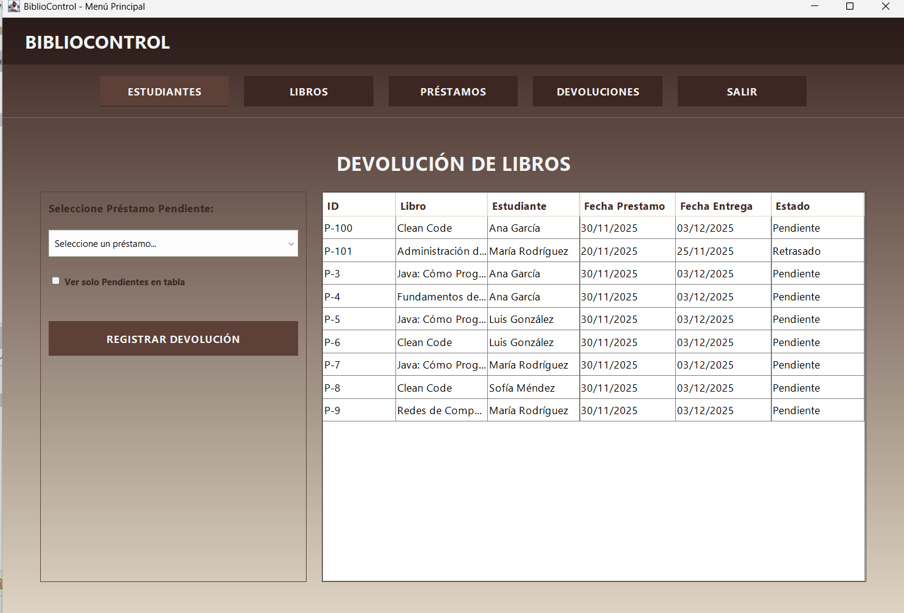
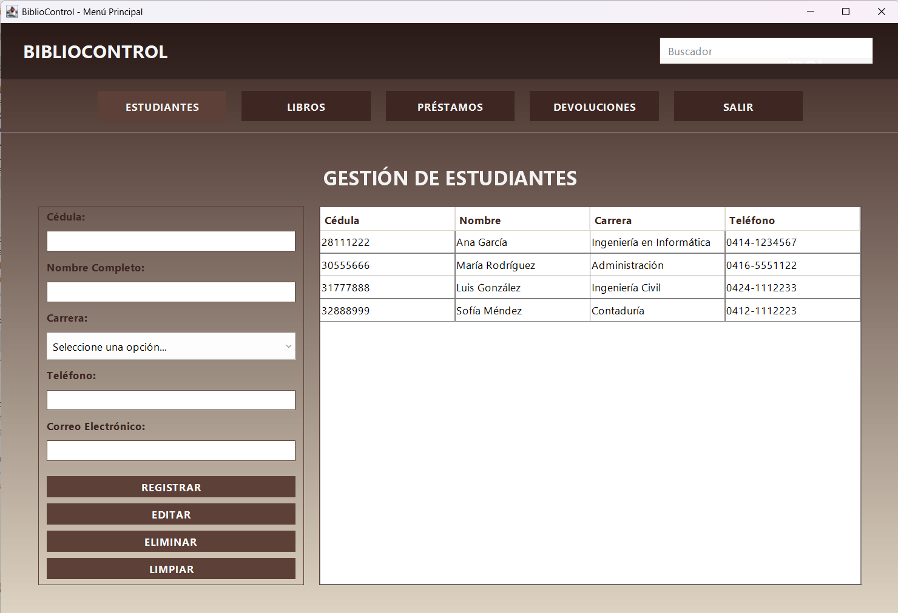

# 📚 BiblioControl - Sistema de Gestión Bibliotecaria

**BiblioControl** es una aplicación de escritorio robusta desarrollada en **Java** con interfaz gráfica **Swing**. Diseñada para administrar el flujo de inventario, usuarios y préstamos de una biblioteca, implementando persistencia de datos mediante archivos planos y reglas de negocio automatizadas.

## 🚀 Características Destacadas

### 🛠 Módulos Principales
1.  **Gestión de Estudiantes:**
    * CRUD completo con validaciones estrictas (Regex para cédula, teléfono y correo).
    * Control de duplicados en tiempo real.
2.  **Inventario de Libros:**
    * Control de Stock automático (se descuenta al prestar, aumenta al devolver).
    * Categorización por áreas (Ingeniería, Derecho, Administración, etc.).
3.  **Sistema de Préstamos Inteligente:**
    * **Filtros en Cascada:** Selección dinámica por Carrera -> Estudiante y Categoría -> Libro.
    * **Cálculo de Fechas:** Definición de plazo de entrega (días) y cálculo automático de fecha límite.
    * **Validación de Morosidad:** El sistema bloquea préstamos a usuarios con libros atrasados ("Retrasado").
    * **Control de Duplicidad:** Impide prestar el mismo libro dos veces al mismo usuario.
4.  **Devoluciones e Historial:**
    * Visualización de estado (Pendiente, Retrasado, Devuelto).
    * Filtros avanzados utilizando **Java Streams** y Lambdas.

### 💻 Aspectos Técnicos
* **Arquitectura:** MVC (Modelo-Vista-Controlador) adaptado.
* **Persistencia:** Archivos de texto (`.txt`) con carga automática.
* **Algoritmos:**
    * Uso de **Clases Genéricas (`<T>`)** para el motor de búsqueda.
    * Uso de **Predicados (`Predicate<T>`)** y Expresiones Lambda para filtrado eficiente.
* **Interfaz:** Java Swing con diseño limpio y validaciones de usuario (`JOptionPane`).

## 📋 Requisitos

* **Java Development Kit (JDK):** Versión 8 o superior.
* **IDE:** NetBeans, IntelliJ IDEA o Eclipse.

## 🔧 Instalación y Ejecución

¡El sistema es portable y no requiere instalación de base de datos!

1.  **Clonar el repositorio:**
    ```bash
    git clone [https://github.com/TU_USUARIO/BiblioControl.git](https://github.com/TU_USUARIO/BiblioControl.git)
    ```
2.  **Abrir el proyecto:**
    * Abre tu IDE y selecciona la carpeta del proyecto.
3.  **Ejecutar:**
    * Busca la clase principal: `InterfacesBiblioteca.MenuPrincipal`.
    * Haz clic en **Run**.
4.  **Datos de Prueba:**
    * *Nota:* Al ejecutar por primera vez, el sistema detectará la ausencia de archivos y generará automáticamente un catálogo de libros y estudiantes de prueba (Seed Data).

## 📂 Estructura del Proyecto

* `AccesoDatosBiblioteca`: Clases controladoras (CRUDs), Manejador de Archivos y Motor de Búsqueda Genérico.
* `Entidadesbiblioteca`: Clases POJO (Libro, Estudiante, Prestamo).
* `InterfacesBiblioteca`: Paneles visuales (JPanels) y Frame principal.

## ✒️ Autor

Proyecto desarrollado por **[Manuel Rodriguez]**.

### Login


### Menú Principal


### Registro de Préstamos


### Registro de Devoluciones


### Gestión de Estudiantes


### Gestión de Libros
